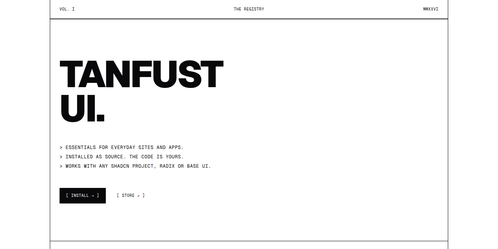
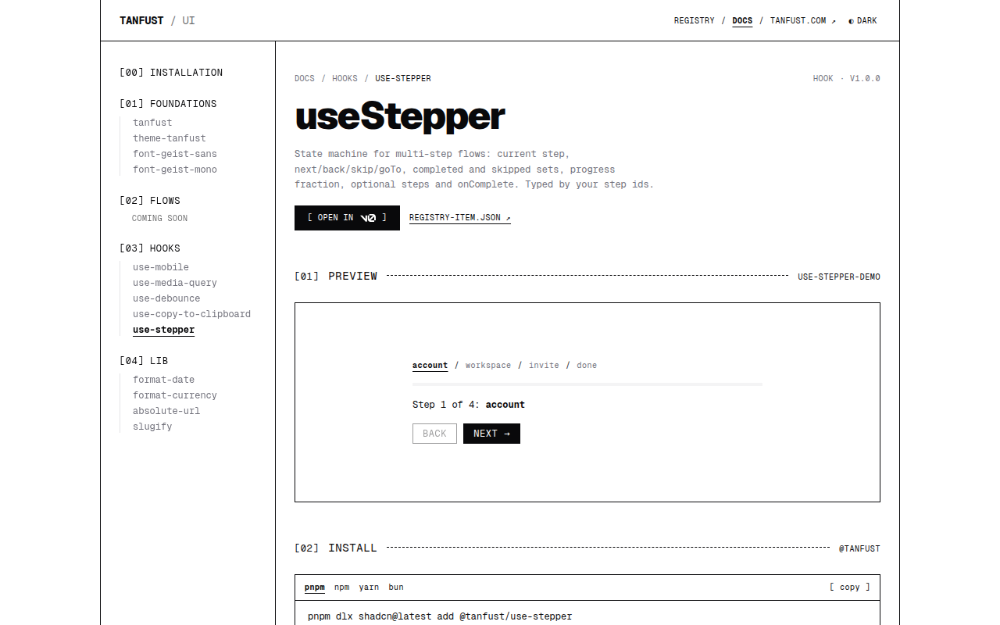

<p align="center">
  <a href="https://ui.tanfust.com"></a>
</p>

<p align="center">
  <a href="https://github.com/tanfust/ui/actions/workflows/registry.yml"></a>
  <a href="./LICENSE"></a>
  <a href="https://ui.tanfust.com/r/registry.json"></a>
  <a href="https://ui.tanfust.com"></a>
</p>

# Tanfust UI

Essential components, hooks and flows for everyday sites and apps, distributed as a
[shadcn](https://ui.shadcn.com/docs/registry)-compatible registry under the `@tanfust` namespace.

Items are copied into your project as **source**. No wrapper package, nothing to upgrade behind
your back, no lock-in. Everything composes shadcn primitives and works whether your project uses
**Radix or Base UI**, on Next.js, TanStack Start, Vite, React Router, Laravel or Astro — the CLI
adapts routes and imports to your setup.

## Use it

```bash
# 1. add the namespace once
npx shadcn@latest registry add @tanfust=https://ui.tanfust.com/r/{name}.json

# 2. install anything
npx shadcn@latest add @tanfust/use-debounce

# or start a new project from the Tanfust design system
npx shadcn@latest init https://ui.tanfust.com/r/tanfust.json
```

Browse at **[ui.tanfust.com/docs](https://ui.tanfust.com/docs)** — every item has a live preview,
its source, the install command and its dependencies. From the terminal: `npx shadcn@latest list @tanfust`.
Preview any install with `--dry-run` and `--diff`.

**Agents:** the registry works with the shadcn MCP server out of the box
(`npx shadcn@latest mcp init --client claude`), publishes a plain-text index at
[/llms.txt](https://ui.tanfust.com/llms.txt), and every item ships a demo the server can return as
a usage example.

## What's inside

| Category | Items |
|---|---|
| **Foundations** | `tanfust` — the design system as one `init` (zinc, 0.625rem radius, Geist, inverted bold menus, namespace pre-registered) · `theme-tanfust` · `font-geist-sans` · `font-geist-mono` |
| **Hooks** | `use-mobile` · `use-media-query` · `use-debounce` · `use-copy-to-clipboard` · `use-stepper` |
| **Lib** | `format-date` · `format-currency` · `absolute-url` · `slugify` — Intl-based, zero dependencies |
| **Flows** | next: onboarding wizard, account & team settings — a page, its components, hooks and provider-agnostic actions as one install |

The registry stays small on purpose. If most sites or apps would not need it, it does not go in.

<p align="center">
  
</p>

## How it works

`registry.json` includes one `registry.json` per category under `src/registry/tanfust/`.
`pnpm registry:build` validates them, runs `shadcn build` to produce the payloads in `public/r/`,
generates the preview index and `llms.txt`. The docs site (TanStack Start, deployed on Cloudflare)
renders its pages from those same payloads, so the site can never disagree with what the CLI
installs. CI rebuilds, fails on a stale `public/r/`, and smoke-installs every item into fresh
Base UI and Radix projects.

## Develop

```bash
pnpm install
pnpm dev            # registry build, then the docs site on http://localhost:3000
pnpm build          # production build → .output/
```

See [CONTRIBUTING.md](./CONTRIBUTING.md) to add an item and [AGENTS.md](./AGENTS.md) for the rules
every item follows (also read by coding agents working in this repo).

## License

[MIT](./LICENSE). Built by [Tanfust](https://tanfust.com) — essentialist tools for doers.
